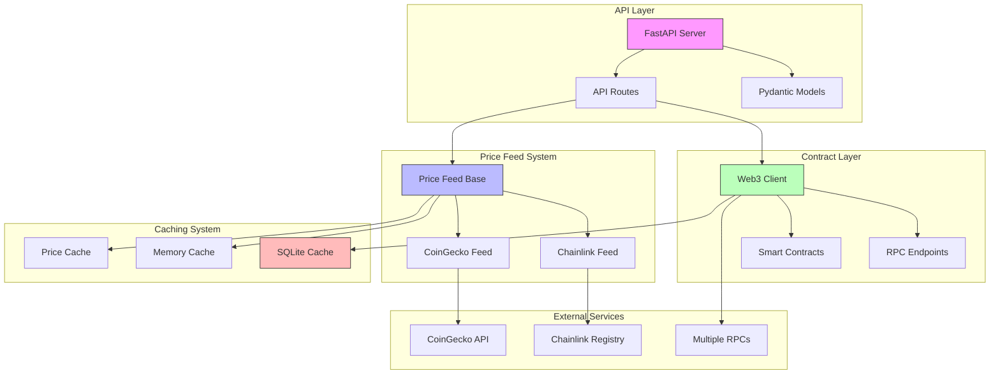

# System Architecture

## Component Relationships

1. API Layer
   - FastAPI server handles HTTP requests
   - Pydantic models validate data
   - Routes coordinate component interactions

2. Price Feed System
   - Abstract base class defines interface
   - Chainlink implementation (primary)
   - CoinGecko implementation (fallback)
   - Shared caching for prices

3. Contract Layer
   - Web3 client manages blockchain interaction
   - Multiple RPC endpoints with fallback
   - Smart contract interface caching
   - Rate limiting and retries

4. Caching System
   - SQLite for Web3 calls
   - Memory cache for frequent data
   - Price-specific caching strategy

5. External Services
   - Chainlink Feed Registry
   - CoinGecko API
   - Multiple RPC providers

## Data Flow

1. Request Flow
   - Client request → API
   - API validates with models
   - Routes coordinate components
   - Components interact with cache
   - External calls if cache miss
   - Response formatted and returned

2. Price Updates
   - Price request received
   - Check Chainlink feed
   - Fallback to CoinGecko if needed
   - Cache successful results
   - Return normalized price

3. Contract Queries
   - Web3 request initiated
   - Check SQLite cache
   - RPC call if cache miss
   - Cache successful results
   - Handle rate limits/errors
   - Return processed data

## System Boundaries

1. Internal Components
   - API server
   - Price feed system
   - Contract interaction layer
   - Caching system
   - Data models

2. External Dependencies
   - Ethereum network
   - Chainlink feeds
   - CoinGecko API
   - RPC providers

3. Integration Points
   - HTTP API endpoints
   - Smart contract interfaces
   - External API clients
   - Cache interfaces